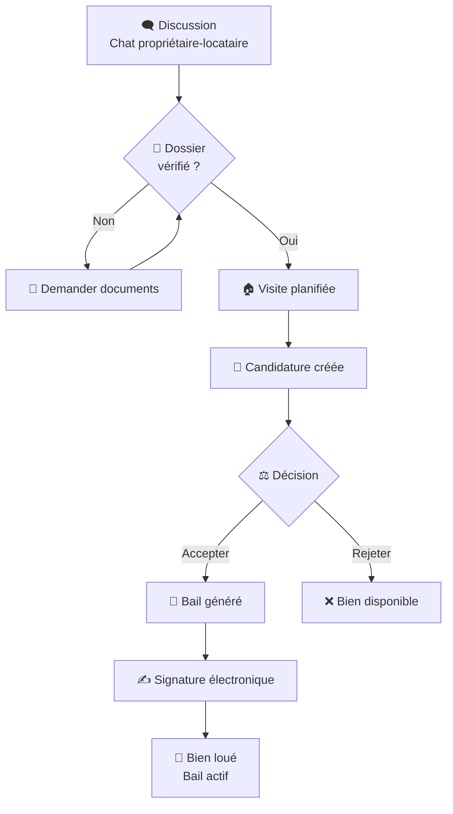

# Workflow Gestion Location Immobilière

## 📋 Vue d'ensemble du processus



---

## 🗄️ Modèles Backend (Django)

### 1. Application (Candidature)

| Champ | Type | Description |
|-------|------|-------------|
| `id` | AutoField | Identifiant unique |
| `property` | ForeignKey → Property | Bien concerné |
| `tenant` | ForeignKey → User | Locataire candidat |
| `owner` | ForeignKey → User | Propriétaire |
| `status` | CharField | `pending` \| `under_review` \| `accepted` \| `rejected` |
| `dossier_status` | CharField | `incomplete` \| `pending` \| `complete` |
| `visit_date` | DateTimeField | Date de visite (nullable) |
| `rejection_reason` | TextField | Motif de rejet (nullable) |
| `created_at` | DateTimeField | Date de création |
| `updated_at` | DateTimeField | Dernière mise à jour |

### 2. Lease / Bail

| Champ | Type | Description |
|-------|------|-------------|
| `id` | AutoField | Identifiant unique |
| `application` | ForeignKey → Application | Candidature source |
| `property` | ForeignKey → Property | Bien loué |
| `tenant` | ForeignKey → User | Locataire |
| `status` | CharField | `draft` \| `sent` \| `signed` \| `active` \| `terminated` |
| `start_date` | DateField | Début du bail |
| `end_date` | DateField | Fin du bail |
| `monthly_rent` | DecimalField | Loyer mensuel |
| `deposit_amount` | DecimalField | Dépôt de garantie |
| `document_url` | URLField | PDF signé |
| `signed_at` | DateTimeField | Date de signature |

### 3. Visit / Visite

| Champ | Type | Description |
|-------|------|-------------|
| `id` | AutoField | Identifiant unique |
| `property` | ForeignKey → Property | Bien visité |
| `tenant` | ForeignKey → User | Visiteur |
| `owner` | ForeignKey → User | Propriétaire |
| `scheduled_date` | DateTimeField | Date/heure prévue |
| `status` | CharField | `scheduled` \| `completed` \| `cancelled` |
| `notes` | TextField | Commentaires post-visite |

### 4. Property (Extensions)

| Champ | Type | Description |
|-------|------|-------------|
| `status` | CharField | `available` \| `reserved` \| `rented` \| `maintenance` |
| `current_tenant` | ForeignKey → User | Locataire actuel (nullable) |
| `current_lease` | ForeignKey → Lease | Bail en cours (nullable) |

---

## 🔄 Machine à états

### Statut du bien (Property)

```
┌─────────────┐    visite planifiée     ┌─────────────┐    bail signé      ┌─────────────┐
│  available  │ ───────────────────────▶│   reserved  │ ─────────────────▶│   rented    │
│  (disponible)│                         │  (réservé)  │                   │   (loué)    │
└──────┬──────┘                         └──────┬──────┘                   └──────┬──────┘
       ▲                                         │                                  │
       │                                         │    candidature                   │
       │                                         │    rejetée                       │
       └─────────────────────────────────────────┘◄─────────────────────────────────┘
                                                 fin bail / résiliation
```

### Statut de la candidature (Application)

```
┌─────────┐     dossier complet      ┌─────────────────┐
│  pending  │ ───────────────────────▶│  under_review   │
│ (en attente)│                       │ (en cours étude) │
└────┬────┘                           └────────┬────────┘
     │                                         │
     │    ┌─────────────┐    ┌─────────────┐   │
     └───▶│  accepted   │    │  rejected   │◀──┘
          │  (acceptée) │    │  (rejetée)  │
          └──────┬──────┘    └──────┬──────┘
                 │                    │
                 ▼                    ▼
          Création bail         Bien redevient
          (Lease.draft)         available
```

### Statut du bail (Lease)

```
┌────────┐   PDF généré   ┌──────┐   envoyé   ┌───────┐   signé 2 parties   ┌────────┐
│ draft  │ ──────────────▶│ sent │ ─────────▶│ signed│ ──────────────────▶│ active │
│(brouillon)│              │(envoyé)│          │(signé)│                    │(actif) │
└────────┘                └──────┘           └───────┘                    └───┬────┘
                                                                              │
                                                                    date fin atteinte
                                                                              │
                                                                              ▼
                                                                       ┌──────────┐
                                                                       │terminated│
                                                                       │(terminé) │
                                                                       └──────────┘
```

---

## 📱 Parcours UI / Écrans

### Côté Propriétaire (Dashboard)

| Écran | Route | Description |
|-------|-------|-------------|
| Liste candidatures | `/dashboard/candidatures` | Tableau avec filtres statut |
| Détail dossier | `/dashboard/dossier/[tenantId]` | Documents locataire + validation |
| Planifier visite | Modal dans Messages | Calendrier + créneaux |
| Accepter candidature | Modal dans Messages | Confirmation + conditions |
| Nouveau bail | `/dashboard/contrats/nouveau` | Assistant dates, montants, PDF |
| Signature bail | `/dashboard/contrats/[id]/sign` | Visualiseur PDF + signature |

### Côté Locataire

| Écran | Route | Description |
|-------|-------|-------------|
| Mes candidatures | `/client/candidatures` | Statut de mes demandes |
| Signer bail | `/client/bail/[leaseId]` | Visualiseur PDF + signature |

---

## 🔔 Notifications & Événements WebSocket

| Événement | Destinataire | Canal WebSocket | Action |
|-----------|-------------|-----------------|--------|
| Dossier complet | Propriétaire | `application_updates.{owner_id}` | Badge + email |
| Visite planifiée | Les deux | — | Email + push + rappel |
| Visite confirmée | Les deux | `presence.{conversation_id}` | Message chat auto |
| Candidature acceptée | Locataire | `lease_notifications.{tenant_id}` | Email urgent |
| Candidature rejetée | Locataire | `lease_notifications.{tenant_id}` | Email + motif |
| Bail prêt à signer | Les deux | — | Email + lien signature |
| Bail signé | Système | — | Mise à jour Property → rented |
| Fin bail (90j) | Les deux | — | Email renouvellement |
| Fin bail (30j) | Les deux | — | Email état des lieux |

---

## 🔌 Endpoints API (Django REST)

### Candidatures

| Méthode | Endpoint | Description |
|---------|----------|-------------|
| `POST` | `/applications/` | Créer une candidature |
| `GET` | `/applications/` | Liste des candidatures (filtrable par owner/tenant) |
| `GET` | `/applications/{id}/` | Détail d'une candidature |
| `PATCH` | `/applications/{id}/` | Mettre à jour statut (accept/reject) |
| `DELETE` | `/applications/{id}/` | Annuler une candidature |

### Baux

| Méthode | Endpoint | Description |
|---------|----------|-------------|
| `POST` | `/leases/` | Créer un bail depuis candidature acceptée |
| `GET` | `/leases/` | Liste des baux |
| `GET` | `/leases/{id}/` | Détail d'un bail |
| `PATCH` | `/leases/{id}/` | Modifier dates/montants (draft uniquement) |
| `POST` | `/leases/{id}/sign/` | Signer le bail (tenant ou owner) |
| `GET` | `/leases/{id}/payments/` | Paiements associés |

### Visites

| Méthode | Endpoint | Description |
|---------|----------|-------------|
| `POST` | `/visits/` | Planifier une visite |
| `PATCH` | `/visits/{id}/` | Modifier/annuler une visite |
| `POST` | `/visits/{id}/complete/` | Marquer visite comme effectuée |

### Propriétés

| Méthode | Endpoint | Description |
|---------|----------|-------------|
| `PATCH` | `/properties/{id}/status/` | Mettre à jour le statut du bien |

---

## ⚡ Règles métier critiques

1. **Unicité réservation** : Un bien `reserved` ne peut recevoir de nouvelles candidatures. Les autres locataires voient "Bien en cours de location".
2. **Candidature → Bail** : Un `Lease` ne peut être créé que si une `Application` avec `status='accepted'` existe.
3. **Bail → Loué** : Un bien ne passe à `rented` que si le `Lease` est `signed` par les deux parties.
4. **Rejet réversible** : Rejeter une candidature archive l'`Application` avec motif, mais conserve l'historique pour analytics.
5. **Fin de bail** : 90 jours avant `end_date`, notification automatique. À `end_date`, si non renouvelé, `Property.status` repasse à `available`.

---

## 🛠️ Phase d'implémentation suggérée

| Phase | Focus | Livrables |
|-------|-------|-----------|
| **1** | Modèles Backend | Migrations Django, serializers, admin |
| **2** | Candidatures | API CRUD, UI dashboard candidatures, bouton chat |
| **3** | Visites | API visites, modal calendrier dans chat |
| **4** | Baux | Génération PDF, signature, statuts |
| **5** | Notifications | WebSocket events, emails, push |
